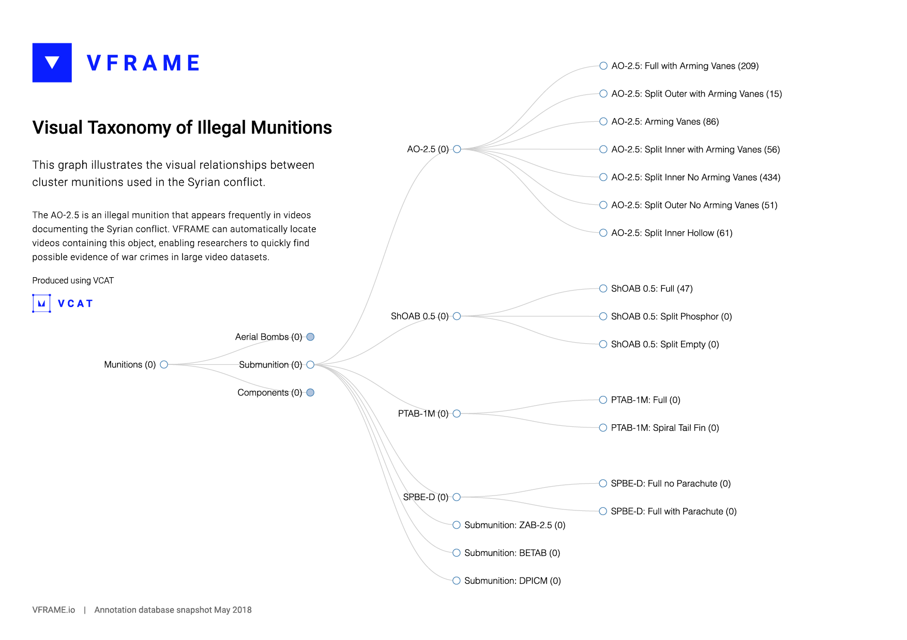
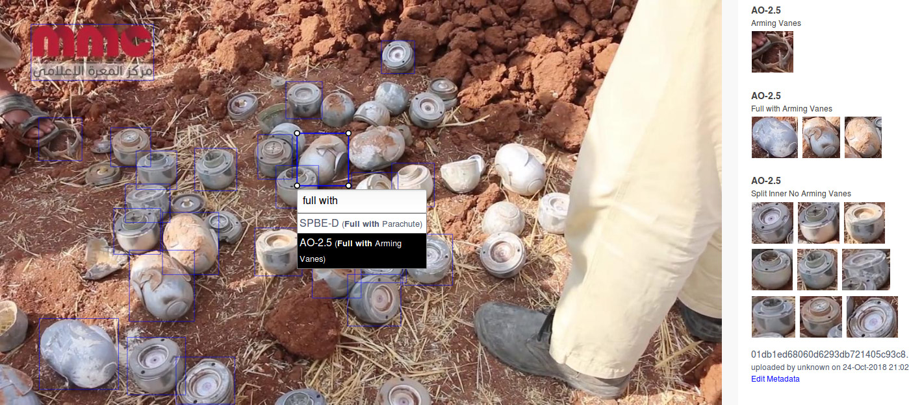
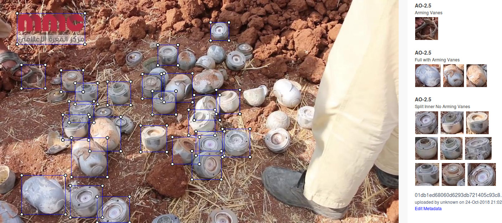
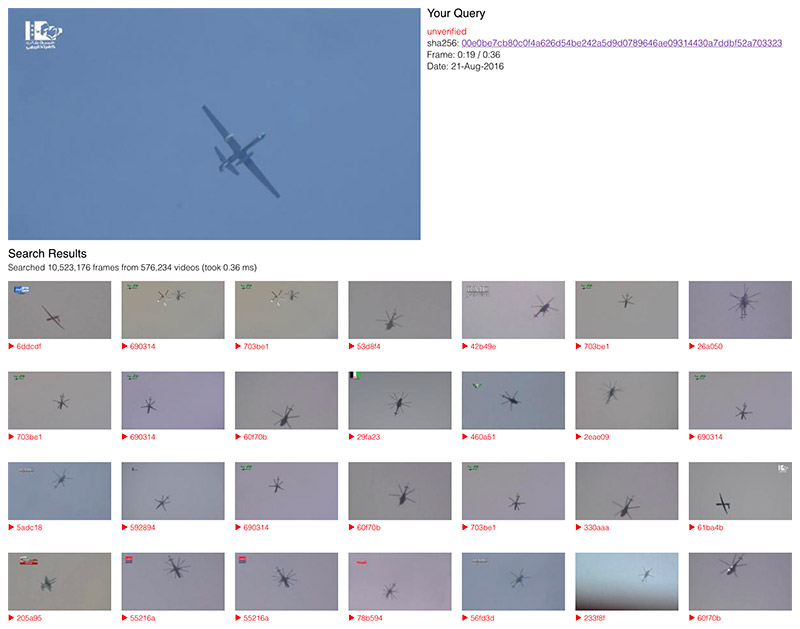
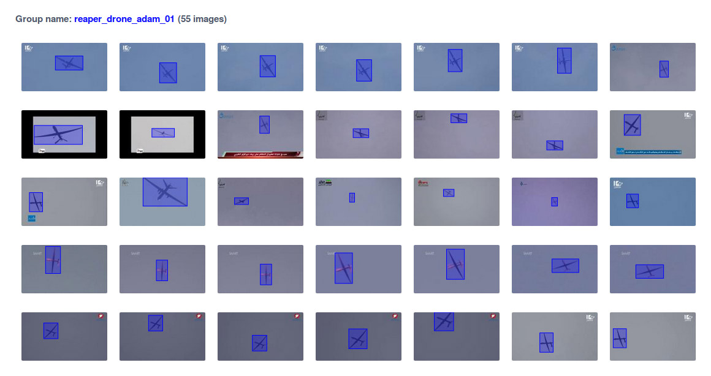

# VCAT: Visual Collection, Annotation, and Training



VCAT is a system for creating machine learning image datasets for computer vision. It uses a Django backend, React frontend, and CNN-based based visual search engine to facilitate creating new datasets and forensic image research.

VCAT's front end can also be used for visual investigations. Searching 10M keyframes takes only 0.15 seconds. VCAT designed to be used with the [VFRAME](https://github.com/vframeio/vframe) computer vision processing tools and is primarily intended for human rights researchers and technologists.


-------------------------


## Getting Started

_This project is under daily development and installations steps may change significantly between Oct 2018 - May 2019_

## Prerequisites

* Ubuntu 16.04 with 16GB RAM
* A conda/virtualenv virtual environment running Python 3.6+
* node v8.5.0 / npm v6.0.0 (suggest installing with nvm)
* MySQL2 (apt install libmysqlclient-dev)


## Installation

```
sudo apt install libmysqlclient-dev
```

### MySQL

Run `mysql -u root` then make a new user and database:

```
CREATE USER 'vframe'@'localhost' IDENTIFIED BY 'password';
CREATE DATABASE vframe;
GRANT ALL PRIVILEGES ON vframe.* TO 'vframe'@'localhost';
```

### Settings

Copy the settings file and edit appropriately (or ask jules for dev config):

```
cp sample-env .env
```

### Python / Django

```
source activate vcat
pip install -r requirements.txt
python manage.py migrate
python manage.py createsuperuser
```

### Node

```
npm install
```

### vsearch

The FAISS-based image search engine lives in `~/vcat/vsearch/` directory.  This is a flask server which runs separately from the main Django app.  Instructions for installing everything are there, including another requirements.txt.  This may be moved into its own repo at some point. Instructions for setting up vsearch can be found in that folder's readme.

If using vsearch with vcat, please run its fixtures:

```
python manage.py migrate vsearch zero
python manage.py migrate
python manage.py loaddata document_tag
python manage.py import_metadata
python manage.py import_metadata --unverified
```

## Running it

Run these commands in separate tabs:

```
python manage.py runserver
npm run watch
```

Note, if developing on Linux you may need to increase the number of filesystem watchers:

```
echo fs.inotify.max_user_watches=524288 | sudo tee -a /etc/sysctl.conf && sudo sysctl -p
```

## Development

Put static images in `backend/api/static/`

## Deployment

### Building the frontend

Production bundles should be built *remotely*. Run `npm run reload` on the remote server.

Services are set up in `/etc/init.d`. Find sample init.d files in `./bin/init.d/`. If there's a problem do `service vcat restart` or `service sis restart`.

## Exporting data

For now you can curl using Basic Auth to hit endpoints like so -

```
curl -u username:password https://syrianarchive.vframe.io/api/hierarchy/1/full
```


----------------------------


## Screenshots of VCAT Application


### Annotate

*Autocomplete visual taxonomy for quick annotation*

*Toggle on/off labels for scenes with many items*

*Display labels and verify annotations*

### Search

Search for similar images using content based image retrieval


*Search results*

### Create Dataset

Use search results to create a new training dataset


*Selection of annotated training images for aircraft*
